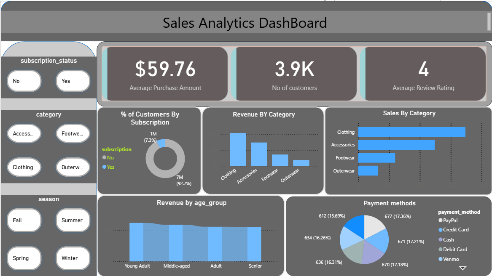

🛍️ Customer Behavior Analysis using Python, SQL & Power BI

📌 Project Overview

This project focuses on analyzing customer shopping behavior to uncover actionable business insights that can help retail organizations improve customer engagement, increase revenue, and support data-driven decision-making.
Using Python for data preparation, SQL for business analysis, and Power BI for interactive visualization, this project demonstrates an end-to-end data analytics workflow suitable for real-world business scenarios.

🎯 Business Problem Statement

A leading retail company wants to gain a better understanding of customer purchasing behavior to increase sales, improve customer satisfaction, and strengthen long-term customer retention.
The company has observed changes in purchasing patterns across different customer age groups, product categories, shopping seasons, and payment methods. Management aims to identify how factors such as promotional discounts, customer ratings, seasonal demand, subscription status, and payment preferences influence customer purchasing decisions.
Business Objective

How can customer shopping data be analyzed to identify meaningful trends, improve customer engagement, and support better marketing and product decisions?

🛠️ Tech Stack
Technology	Purpose
Python	Data Cleaning & Preprocessing
PostgreSQL / SQL	Business Analysis & Querying
Power BI	Interactive Dashboard & Visualization
Git & GitHub	Version Control
Pandas	Data Manipulation
NumPy	Numerical Analysis

📈 Dashboard Features

The Power BI dashboard provides interactive insights into customer purchasing behavior through:

📌 Average Purchase Amount
👥 Total Customers
⭐ Average Review Rating
🛍️ Revenue by Product Category
📦 Sales by Category
👨‍👩‍👧 Customer Distribution by Subscription Status
💳 Payment Method Analysis
🎂 Revenue by Customer Age Group
🎛️ Interactive Filters (Season, Category, Subscription Status)
📋 Project Deliverables

1️⃣ Data Preparation (Python)
Data Cleaning
Missing Value Handling
Data Transformation
Feature Engineering
Data Validation

2️⃣ Business Analysis (SQL)

Business-focused SQL analysis including:

Revenue Analysis
Customer Segmentation
Product Category Performance
Subscription Analysis
Discount Impact Analysis
Seasonal Sales Trends
Customer Spending Behavior
Payment Method Analysis

3️⃣ Dashboard Development (Power BI)

Interactive dashboard with

KPI Cards
Dynamic Filters
Interactive Charts
Business Insights
Executive Summary

4️⃣ Project Report

Includes
Business Understanding
Data Cleaning Process
SQL Analysis
Dashboard Explanation
Key Findings
Business Recommendations

5️⃣ GitHub Repository
The repository contains

Python Source Code
SQL Scripts
Power BI Dashboard
Dataset
Project Documentation
Report & Presentation
📌 Key Performance Indicators (KPIs)
💰 Average Purchase Amount
👥 Total Customers
⭐ Average Review Rating
📈 Revenue by Product Category
💳 Payment Method Distribution
🛍️ Sales by Category
🎂 Revenue by Age Group
📦 Subscription-Based Customer Analysis
